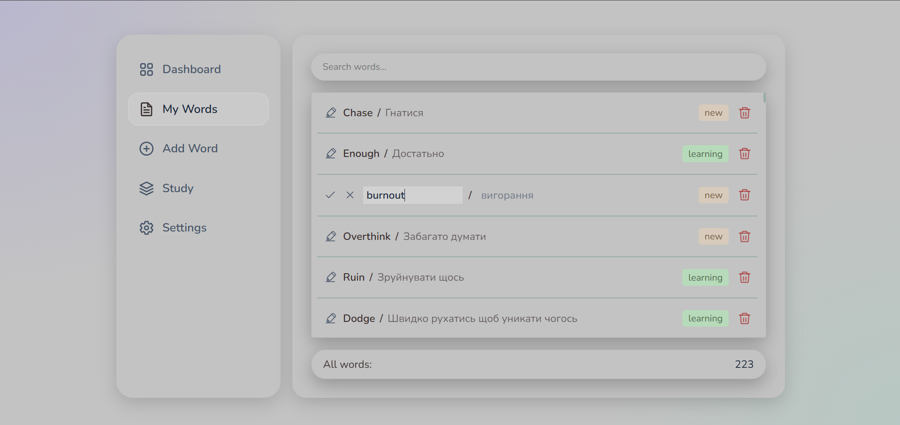

# MyFlashCards

MyFlashCards is a responsive English vocabulary learning application built with Vanilla JavaScript, SCSS, Vite and JSON Server.

The application allows users to create and manage vocabulary, track learning progress and practise words through a weighted study mode.

## Preview

### Words Management



### Study Mode


## Main Features

* Create, edit and delete vocabulary cards
* Search words in real time
* Validate English and Ukrainian input
* Track word status and repetition count
* Automatically update learning progress
* Practise words in multiple-choice study mode
* Prioritize difficult and recently added words
* Display live learning statistics
* Switch between light and dark themes
* Use the application on desktop, tablet and mobile devices

## Tech Stack

* HTML5
* SCSS
* Vanilla JavaScript ES6+
* Vite
* JSON Server
* REST API
* Git and GitHub

## Architecture

The project follows a modular structure that separates user interface logic, application state and API communication.

### Main modules

* `wordsApi` — communicates with the JSON Server REST API
* `wordsStore` — stores vocabulary data and notifies subscribed components
* `wordValidation` — validates and normalizes form data
* `initWordsList` — renders vocabulary and handles editing, deletion and search
* `initForm` — handles the creation of new vocabulary cards
* `initStudy` — controls study questions and learning progress
* `initDashboard` — calculates and displays statistics
* `initSettings` — manages theme preferences

## State Management

The application uses a custom store based on the publish–subscribe pattern.

Components subscribe to the store and automatically receive updated vocabulary data after API operations. Each subscription returns an `unsubscribe` function to prevent unnecessary listeners.

This approach separates data management from rendering logic without using a frontend framework.

## Learning Progress

Each vocabulary card contains a `repetitions` value and a learning `status`.

```text
0–4 repetitions   → new
5–14 repetitions  → learning
15+ repetitions   → learned
```

After a correct answer, the repetition count is increased and the word status is recalculated automatically.

## Weighted Study Mode

Study Mode uses weighted random selection:

```text
new       → high priority
learning  → medium priority
learned   → low priority
```

New and less-practised words appear more often, while learned words appear less frequently.

## Validation

The application validates both English words and Ukrainian translations.

Validation includes:

* Required fields
* Minimum and maximum length
* English character validation
* Ukrainian character validation
* Input normalization
* Field-specific error messages

## Getting Started

### 1. Clone the repository

```bash
git clone https://github.com/AndriiBezuhlyi/MyFlashCards.git
```

### 2. Open the project directory

```bash
cd MyFlashCards
```

### 3. Install dependencies

```bash
npm install
```

### 4. Start JSON Server

```bash
npm run server
```

The API will be available at:

```text
http://localhost:3000
```

### 5. Start the development server

Open another terminal and run:

```bash
npm run dev
```

The application will normally be available at:

```text
http://localhost:5173
```

## Available Scripts

```bash
npm run dev
```

Starts the Vite development server.

```bash
npm run server
```

Starts JSON Server on port 3000.

```bash
npm run build
```

Creates a production build.

```bash
npm run preview
```

Runs the production build locally.

## What I Practised

* Creating a CRUD application with Vanilla JavaScript
* Working with asynchronous REST API requests
* Building a custom state store
* Applying the publish–subscribe pattern
* Separating UI, state and API logic
* Creating reusable form validation
* Rendering dynamic interface components
* Managing loading, editing and deletion states
* Building responsive layouts
* Organizing SCSS into reusable modules
* Using Git and GitHub throughout development

## Planned Improvements

* Deploy a publicly accessible live version
* Add automated tests
* Add word sorting and filtering
* Add import and export functionality
* Add reverse and text-input study modes
* Implement review dates and a spaced-repetition algorithm

## Author

Created by [Andrii Bezuhlyi](https://github.com/AndriiBezuhlyi).
