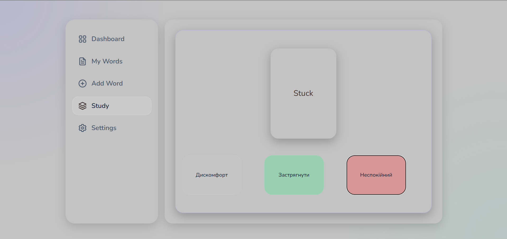

# MyFlashCards

**MyFlashCards** is a responsive flashcard learning app built with Vanilla JavaScript, Vite, SCSS and JSON Server.

The app helps users create, manage and study English words with translations using a simple learning progress system and weighted study mode.

## Preview

### Words List


### Study Mode



## Overview

MyFlashCards is a full-featured frontend application created without frameworks.

The project includes real app logic: CRUD operations, form validation, state management, dashboard statistics, study mode, word progress tracking, responsive layout and theme switching.

The main goal of this project is to demonstrate clean Vanilla JavaScript architecture, modular code organization and practical UI/UX decisions.

## Features

- Add new English words with translations
- Edit existing words
- Delete words with confirmation modal
- Search words in real time
- Validate form inputs
- Track word learning status:
  - `new`
  - `learning`
  - `learned`
- Automatically update repetitions after correct answers
- Automatically change word status based on repetitions
- Study mode with multiple-choice answers
- Weighted word selection:
  - new words appear more often
  - learning words appear moderately often
  - learned words appear rarely
- Dashboard with live statistics
- Light and dark themes
- Responsive layout for desktop, tablet and mobile
- JSON Server API imitation
- Modular JavaScript structure
- SCSS architecture with variables, mixins and reusable UI styles

## Tech Stack

- HTML5
- SCSS
- Vanilla JavaScript
- Vite
- JSON Server
- Git / GitHub

## Architecture

The project is built with a modular structure.

The app uses a custom store for words management. Components subscribe to the store and re-render when the data changes.

Main parts of the architecture:

- `wordsApi` — handles API requests
- `wordsStore` — keeps app state and notifies subscribers
- `wordValidation` — validates word data
- `services` — contains reusable helper functions
- `initWordsList` — renders and manages the words list
- `initForm` — handles adding new words
- `initStudy` — handles study mode and progress logic
- `initDashboard` — renders live statistics
- `initSettings` — manages theme switching

This structure keeps the code easier to read, maintain and extend.

## Project Structure

```txt
MyFlashCards/
├── db.json
├── index.html
├── package.json
├── vite.config.js
└── src/
    ├── js/
    │   ├── components/
    │   │   ├── addWord.js
    │   │   ├── dashboard.js
    │   │   ├── settings.js
    │   │   ├── study.js
    │   │   ├── tabs.js
    │   │   └── wordsList.js
    │   ├── services/
    │   │   ├── services.js
    │   │   ├── wordValidation.js
    │   │   └── wordsApi.js
    │   ├── store/
    │   │   └── wordsStore.js
    │   └── main.js
    └── sass/
        ├── base/
        ├── blocks/
        ├── ui/
        └── main.scss
```

## Word Progress Logic

Each word has a `repetitions` field and a `status`.

When the user answers correctly in Study Mode, the word receives `+1` repetition.

The status changes automatically:

```txt
0–4 repetitions      → new
5–14 repetitions     → learning
15+ repetitions      → learned
```

## Weighted Study Mode

Study Mode uses weighted random selection.

Words are selected based on their learning status:

```txt
new      → high priority
learning → medium priority
learned  → low priority
```

This means that new words appear more often, while already learned words appear less frequently.

Example priority logic:

```js
function getWordWeight(word) {
	if (word.status === 'new') return 5
	if (word.status === 'learning') return 3
	if (word.status === 'learned') return 1

	return 1
}
```

This creates a simple learning experience similar to a basic spaced repetition system.

## Validation

The app validates both English and Ukrainian inputs.

Validation includes:

- required fields
- minimum length
- maximum length
- English-only validation for English words
- Ukrainian-only validation for translations
- reusable validation result object with:
  - `isValid`
  - `values`
  - `errors`

Example validation result:

```js
{
	isValid: true,
	values: {
		english: 'apple',
		translate: 'яблуко'
	},
	errors: {
		english: '',
		translate: ''
	}
}
```

## Getting Started

### 1. Clone the repository

```bash
git clone https://github.com/AndriiBezuhlyi/MyFlashCards.git
```

### 2. Go to the project folder

```bash
cd MyFlashCards
```

### 3. Install dependencies

```bash
npm install
```

### 4. Start JSON Server

```bash
npm run server
```

### 5. Start the development server

Open a second terminal and run:

```bash
npm run dev
```

The app will be available at:

```txt
http://localhost:5173
```

## Available Scripts

### Start Vite development server

```bash
npm run dev
```

### Start JSON Server

```bash
npm run server
```

### Build the project

```bash
npm run build
```

### Preview production build locally

```bash
npm run preview
```

## Example API Data

The app uses `db.json` as a mock database.

Example word object:

```json
{
	"id": 1,
	"english": "chase",
	"translate": "гнатися",
	"status": "new",
	"repetitions": 0
}
```

## Responsive Design

The app is adapted for:

- desktop screens
- laptops
- tablets
- mobile devices

Layout behavior:

- desktop: sidebar navigation + main content
- tablet/mobile: compact navigation
- words list becomes scrollable inside the content area
- study answers adapt from grid layout to a single-column layout on mobile
- large screens have optimized container width and spacing

## What I Learned

During this project, I practiced:

- building a real CRUD application with Vanilla JavaScript
- working with a mock REST API
- creating a custom store with subscriptions
- separating UI logic from data logic
- building reusable validation logic
- rendering dynamic components
- handling edit states
- working with async API requests
- building responsive layouts
- organizing SCSS files
- using CSS variables for themes
- improving UI/UX for different screen sizes
- using Git and GitHub workflow

## Future Improvements

Possible future improvements:

- add filtering by word status
- add bulk delete
- add sorting
- add import/export words
- add real spaced repetition with `lastReviewedAt` and `nextReviewAt`
- add user accounts
- replace JSON Server with a real backend
- add tests
- add animations for study mode
- add progress history

## Development Notes

This project was built solo, written line by line without relying on AI to
generate ready-made code. I used Claude/ChatGPT as a mentor throughout development —
mainly to sanity-check architectural decisions (e.g. whether a custom
pub-sub store made sense for a vanilla JS app of this size) and to get
explanations for concepts I hadn't used before, like why `subscribe` should
return an `unsubscribe` function. All implementation choices, bugs, and
trade-offs in this codebase are my own.

## Author

Created by **Andrii Bezuhlyi**

GitHub: [AndriiBezuhlyi](https://github.com/AndriiBezuhlyi)
